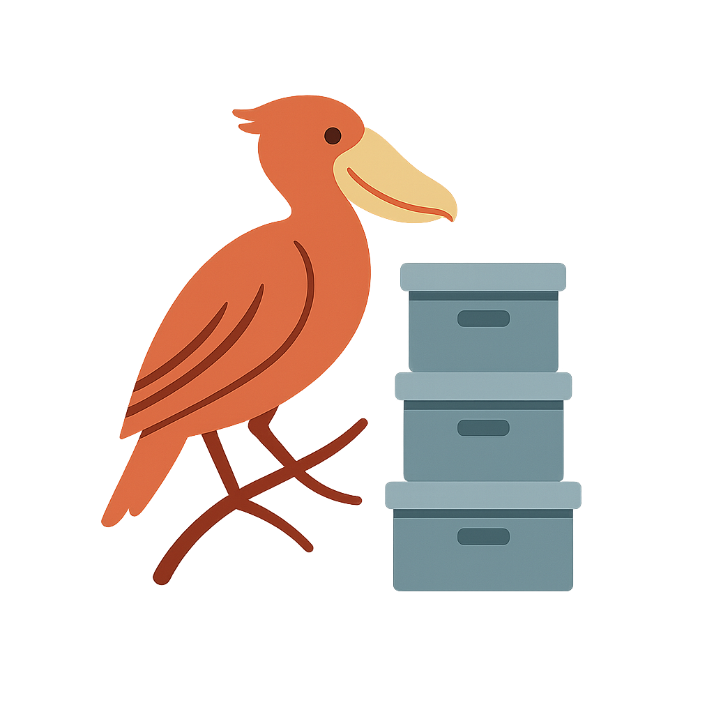

<p align="center">
  
</p>

# genro-storage

[](https://pypi.org/project/genro-storage/)
[](https://www.python.org/downloads/)
[](https://opensource.org/licenses/Apache-2.0)
[](https://genro-storage.readthedocs.io/en/latest/?badge=latest)
[](https://github.com/genropy/genro-storage/actions)
[](https://codecov.io/gh/genropy/genro-storage)
[](https://github.com/psf/black)

**Universal storage abstraction for Python with pluggable backends**

A modern, elegant Python library that provides a unified interface for accessing files across local filesystems, cloud storage (S3, GCS, Azure), and remote protocols (HTTP). Built on top of **fsspec**, genro-storage adds an intuitive mount-point system and user-friendly API inspired by Unix filesystems.

## Documentation

- **[Full Documentation](https://genro-storage.readthedocs.io/)** - Complete API reference and guides
- **[API Reference](docs/api_reference.rst)** - Every public method, in the docs tree
- **[Encryption](docs/encryption.rst)** - At-rest encryption, keys and domains
- **[Testing Guide](TESTING.md)** - How to run tests with MinIO
- **[Interactive Tutorials](notebooks/)** - Hands-on Jupyter notebooks
- **[Changelog](docs/changelog.rst)** - Release history

## Status: Beta - Ready for Production Testing

**Current Version:** 0.8.0
**Last Updated:** August 2026

- Core implementation complete
- 15 storage backends working (local, S3, GCS, Azure, HTTP, Memory, Base64, SMB, SFTP, ZIP, TAR, Git, GitHub, WebDAV, LibArchive)
- 572 tests (565 passing, 7 skipped) with 87% coverage on Python 3.11-3.13
- Full documentation on ReadTheDocs
- Battle-tested code from Genropy (20 years in production, storage abstraction since 2018)
- Available on PyPI

## Key Features

- **Mount point system** - Organize storage with logical names like `home:`, `uploads:`, `s3:`
- **Intuitive API** - Pathlib-inspired interface that feels natural and Pythonic
- **Async/await support** - Transparent sync/async via `@smartasync`: the same objects work in both contexts
- **Pythonic configuration** - Declare mounts as typed method calls with the `StorageConfig` grammar, or load YAML/JSON/dicts
- **Per-file encryption at rest** - Encrypt at the write site; the stored file is a self-describing envelope
- **Native permission control** - Configure readonly, readwrite, or delete permissions for any backend
- **Powered by fsspec** - Leverage 20+ battle-tested storage backends
- **Intelligent copy strategies** - Skip files by existence, size, or hash for efficient incremental backups
- **Progress tracking** - Built-in callbacks for progress bars and logging during copy operations
- **Content-based comparison** - Compare files by MD5 hash across different backends
- **Efficient hashing** - Uses cloud metadata (S3 ETag) when available, avoiding downloads
- **External tool integration** - `call()` method for seamless integration with ffmpeg, imagemagick, pandoc, etc.
- **WSGI file serving** - `serve()` method for web frameworks (Flask, Django, Pyramid) with ETag caching
- **MIME type detection** - Automatic content-type detection from file extensions
- **Dynamic paths** - Support for callable paths that resolve at runtime (perfect for user-specific directories)
- **Cloud metadata** - Get/set custom metadata on S3, GCS, Azure files
- **URL generation** - Generate presigned URLs for S3, public URLs for sharing
- **Base64 data URIs** - Embed data inline with automatic encoding (writable with mutable paths)
- **S3 versioning** - Access historical file versions (when S3 versioning enabled)
- **Test-friendly** - In-memory backend for fast, isolated testing
- **Lightweight core** - Optional backends installed only when needed
- **Cross-storage operations** - Copy/move files between different storage types seamlessly

## Why genro-storage vs raw fsspec?

While **fsspec** is powerful, genro-storage provides:

- **Mount point abstraction** - Work with logical names instead of full URIs
- **Simpler API** - Less verbose, more intuitive for common operations
- **Configuration management** - Load storage configs from files or from a typed grammar
- **Enhanced utilities** - Cross-storage copy, unified error handling, encryption at rest

Think of it as **"requests" is to "urllib"** - a friendlier interface to an excellent foundation.

## Perfect For

- **Multi-cloud applications** that need storage abstraction
- **Data pipelines** processing files from various sources
- **Web applications** managing uploads across environments
- **CLI tools** that work with local and remote files
- **Testing scenarios** requiring storage mocking

## Quick Example

### Synchronous Usage

```python
from genro_storage import StorageManager

# Configure storage backends
storage = StorageManager()
storage.configure([
    {'name': 'home', 'protocol': 'local', 'base_path': '/home/user'},
    {'name': 'uploads', 'protocol': 's3', 'bucket': 'my-app-uploads'},
    {'name': 'backups', 'protocol': 'gcs', 'bucket': 'my-backups', 'permissions': 'readwrite'},
    {'name': 'public', 'protocol': 'http', 'base_path': 'https://cdn.example.com', 'permissions': 'readonly'},
    {'name': 'data', 'protocol': 'base64'}  # Inline base64 data
])

# Work with files using a unified API
node = storage.node('uploads:users/123/avatar.jpg')
if node.exists():
    # Copy from S3 to local
    node.copy_to(storage.node('home:cache/avatar.jpg'))

    # Read and process
    data = node.read_bytes()

    # Backup to GCS
    node.copy_to(storage.node('backups:avatars/user_123.jpg'))

# Base64 backend: embed data directly in URIs (data URI style)
# Read inline data
import base64
text = "Configuration data"
b64_data = base64.b64encode(text.encode()).decode()
node = storage.node(f'data:{b64_data}')
print(node.read_text())  # "Configuration data"

# Or write to create base64 (path updates automatically)
node = storage.node('data:')
node.write_text("New content")
print(node.path)  # "TmV3IGNvbnRlbnQ=" (base64 of "New content")

# Copy from S3 to base64 for inline use
s3_image = storage.node('uploads:photo.jpg')
b64_image = storage.node('data:')
s3_image.copy_to(b64_image)
data_uri = f"data:image/jpeg;base64,{b64_image.path}"

# Advanced features
# 1. Intelligent incremental backups
docs = storage.node('home:documents')
s3_backup = storage.node('uploads:backup/documents')

# Skip files that already exist (fastest)
docs.copy_to(s3_backup, skip='exists')

# Skip files with same size (fast, good accuracy)
docs.copy_to(s3_backup, skip='size')

# Skip files with same content (accurate, uses S3 ETag - fast!)
docs.copy_to(s3_backup, skip='hash')

# With progress tracking
from tqdm import tqdm
pbar = tqdm(desc="Backing up", unit="file")
docs.copy_to(s3_backup, skip='hash',
          progress=lambda cur, tot: pbar.update(1))
pbar.close()

# 2. Work with external tools using call() (ffmpeg, imagemagick, etc.)
video = storage.node('uploads:video.mp4')
thumbnail = storage.node('uploads:thumb.jpg')

# Automatically handles cloud download/upload
video.call('ffmpeg', '-i', video, '-vf', 'thumbnail', '-frames:v', '1', thumbnail)

# Or use local_path() for more control
with video.local_path(mode='r') as local_path:
    import subprocess
    subprocess.run(['ffmpeg', '-i', local_path, 'output.mp4'])

# 3. Serve files via WSGI (Flask, Django, Pyramid)
from flask import Flask, request
app = Flask(__name__)

@app.route('/files/<path:filepath>')
def serve_file(filepath):
    node = storage.node(f'uploads:{filepath}')
    # ETag caching, streaming, MIME types - all automatic!
    return node.serve(request.environ, lambda s, h: None, cache_max_age=3600)

# 4. Check MIME types
doc = storage.node('uploads:report.pdf')
print(doc.mimetype)  # 'application/pdf'

# 5. Dynamic paths for multi-user apps
def get_user_storage():
    user_id = get_current_user()
    return f'/data/users/{user_id}'

storage.configure([
    {'name': 'user', 'protocol': 'local', 'base_path': get_user_storage}
])
# Path resolves differently per user!

# 6. Cloud metadata
file = storage.node('uploads:document.pdf')
file.set_metadata({
    'Author': 'John Doe',
    'Department': 'Engineering'
})

# 7. Generate shareable URLs
url = file.url(expires_in=3600)  # S3 presigned URL

# 8. Encode to data URI
img = storage.node('home:logo.png')
data_uri = img.to_base64()  # data:image/png;base64,...

# 9. Download from internet
remote = storage.node('uploads:downloaded.pdf')
remote.fill_from_url('https://example.com/file.pdf')
```

### Pythonic Configuration

Beyond dicts and YAML, mounts can be declared as typed method calls with the
`StorageConfig` grammar. The element name *is* the protocol, required fields are
the parameters without a default, and a wrong value is rejected by the signature
itself rather than at first use:

```python
from genro_bag.resolvers import EnvResolver
from genro_storage import StorageConfig, StorageManager

class MyConfig(StorageConfig):
    def main(self, root):
        m = root.mounts(storage_key=EnvResolver('STORAGE_KEY'))
        m.local(name='home', base_path='/srv/data')
        m.local(name='secure', base_path='/srv/secure', default_encrypted=True)
        m.s3(name='uploads', bucket='my-bucket',
             secret_key=EnvResolver('S3_SECRET'))
        m.relative(name='public', path='home:public', permissions='readonly')

storage = StorageManager()
storage.configure(MyConfig)
```

Values that come from outside the recipe — secrets, endpoints, deployment roots —
are declared in place as a `BagResolver` and resolved once, at configuration
time. Hosts that embed storage in a larger document mount the vocabulary alone
through `StorageManager.grammar`.

### Encryption at Rest

Encryption is per file and declared at the write site. Reads need no
declaration: the stored bytes carry a self-describing envelope — a
`#GNRE1:<domain>` header followed by the Fernet token — so encrypted and plain
files coexist in the same directory.

```python
storage = StorageManager()
storage.configure(MyConfig)                 # or storage_key='<fernet-key>'

node = storage.node('secure:token.json')
node.write_text(payload, encrypted=True)    # default domain
node.write_text(payload, encrypted='acmespa')  # named domain
print(node.read_text())                     # decrypted, nothing to declare
```

Key material is one or more comma-separated Fernet keys, each optionally
prefixed with `<domain>:`. Keys of the same domain group into one `MultiFernet`:
the first encrypts, all decrypt, which is how a key is rotated. A mount may
carry `default_encrypted` as the default for writes that declare nothing — an
explicit `encrypted=` at the write site wins in both directions.

The coverage boundary is deliberate: the paths that hand out or report on the
stored bytes directly — `open()`, `local_path()` (and the `call()`/`serve()`
built on it), `copy_to()`/`move_to()`, versioned reads, `size()`/`md5hash()` —
carry the envelope verbatim, so an encrypted file stays self-describing wherever
it lands. There is no silent degradation: a domain with no installed key raises
rather than writing plaintext.

Encryption is opt-in — with no key material no cipher is ever built and
`cryptography` is never needed. Install it with `pip install genro-storage[encryption]`.

### Async Usage

All I/O methods are decorated with `@smartasync`, so the same `StorageManager`
and `StorageNode` objects work in both contexts: in sync code the methods
execute directly, in async code they return awaitables.

```python
from genro_storage import StorageManager

# Same StorageManager works in both sync and async contexts
storage = StorageManager()
storage.configure([
    {'name': 'uploads', 'protocol': 's3', 'bucket': 'my-app-uploads'},
    {'name': 'cache', 'protocol': 'local', 'base_path': '/tmp/cache'}
])

# Use in async context (FastAPI, asyncio, etc.)
async def process_file(file_path: str):
    node = storage.node(f'uploads:{file_path}')

    # All I/O methods are awaitable in async context
    if await node.exists():
        data = await node.read_bytes()

        # Process and cache
        processed = process_data(data)
        cache_node = storage.node('cache:processed.dat')
        await cache_node.write_bytes(processed)

        return processed

    raise FileNotFoundError(file_path)

# FastAPI example
from fastapi import FastAPI, HTTPException

app = FastAPI()

@app.get("/files/{filepath:path}")
async def get_file(filepath: str):
    """Serve file from S3 storage."""
    node = storage.node(f'uploads:{filepath}')

    if not await node.exists():
        raise HTTPException(status_code=404, detail="File not found")

    return {
        "data": await node.read_bytes(),
        "size": await node.size(),
        "mime_type": node.mimetype  # Non-I/O property (sync)
    }

# Concurrent operations
import asyncio

async def backup_files(file_list):
    """Backup multiple files concurrently."""
    async def backup_one(filepath):
        source = storage.node(f'uploads:{filepath}')
        target = storage.node(f'backups:{filepath}')
        data = await source.read_bytes()
        await target.write_bytes(data)

    # Process all files in parallel
    await asyncio.gather(*[backup_one(f) for f in file_list])
```

## Learning with Interactive Tutorials

The best way to learn genro-storage is through our **hands-on Jupyter notebooks** in the [`notebooks/`](notebooks/) directory. They are executed by the test suite on every run, so what they show is what the current release does.

```bash
# 1. Install genro-storage and Jupyter
pip install "genro-storage[all]" jupyter notebook

# 2. Navigate to notebooks directory
cd notebooks

# 3. Launch Jupyter
jupyter notebook

# 4. Open 01_quickstart.ipynb and start learning!
```

**Note:** Jupyter will open in your browser automatically. Execute cells sequentially with `Shift+Enter`.

### Tutorial Contents

| Notebook | Topic | Duration | Level |
|----------|-------|----------|-------|
| 01 - Quickstart | Basic concepts and first steps | 15 min | Beginner |
| 02 - Backends | Storage backends and configuration | 20 min | Beginner |
| 03 - File Operations | Read, write, copy, directories | 25 min | Beginner |
| 04 - Virtual Nodes | iternode, diffnode, zip archives | 30 min | Intermediate |
| 05 - Copy Strategies | Smart copying and filtering | 25 min | Intermediate |
| 06 - Versioning | S3 version history and rollback | 30 min | Intermediate |
| 07 - Advanced Features | External tools, WSGI, metadata | 35 min | Advanced |
| 08 - Real World Examples | Complete use cases | 40 min | Advanced |

**Total time:** ~3.5 hours • **Start here:** [01_quickstart.ipynb](notebooks/01_quickstart.ipynb)

See [notebooks/README.md](notebooks/README.md) for the complete learning guide.

## Installation

### From PyPI

```bash
# Base package
pip install genro-storage

# With S3 support
pip install "genro-storage[s3]"

# With all backends and encryption
pip install "genro-storage[all]"
```

### From Source (Development)

Clone and install in editable mode:

```bash
# Clone repository
git clone https://github.com/genropy/genro-storage.git
cd genro-storage

# Install base package
pip install -e .

# Install with S3 support
pip install -e ".[s3]"

# Install with all backends
pip install -e ".[all]"

# Install for development
pip install -e ".[all,dev]"
```

### Supported Backends

Install optional dependencies for specific backends:

```bash
# Cloud storage
pip install "genro-storage[s3]"          # Amazon S3
pip install "genro-storage[gcs]"         # Google Cloud Storage
pip install "genro-storage[azure]"       # Azure Blob Storage

# Network protocols
pip install "genro-storage[http]"        # HTTP/HTTPS
pip install "genro-storage[smb]"         # SMB/CIFS (Windows/Samba shares)
pip install "genro-storage[sftp]"        # SFTP (SSH File Transfer)
pip install "genro-storage[webdav]"      # WebDAV (Nextcloud, ownCloud, SharePoint)

# Archive formats
pip install "genro-storage[libarchive]"  # RAR, 7z, ISO, and 20+ formats

# Version control
pip install "genro-storage[git]"         # Local Git repositories (pygit2)
pip install "genro-storage[github]"      # GitHub repositories (requests)

# Encryption at rest
pip install "genro-storage[encryption]"  # cryptography

# Everything
pip install "genro-storage[all]"         # All backends + encryption
```

**Built-in backends** (no extra dependencies):
- Local filesystem
- Memory (in-memory storage for testing)
- Base64 (inline data URIs)
- ZIP archives
- TAR archives (with gzip, bzip2, xz compression)

## Testing

```bash
# Unit tests (fast, no external dependencies)
pytest -m "not integration"

# Integration tests (requires Docker: MinIO, fake-gcs, Azurite, SFTP, Samba, WebDAV)
docker compose -f tests/docker-compose.yml up -d
pytest -m integration

# All tests, with the services running
pytest

# Or let Make start the services for you
make test
```

Without the Docker services the integration tests are deselected and coverage
lands around 78%; with them the full suite reports 87%.

See [TESTING.md](TESTING.md) for detailed testing instructions with MinIO.

## Built With

- [fsspec](https://filesystem-spec.readthedocs.io/) - Pythonic filesystem abstraction
- [genro-toolbox](https://github.com/genropy/genro-toolbox) - `@smartasync` for transparent sync/async
- [genro-builders](https://github.com/genropy/genro-builders) - the grammar machinery behind `StorageConfig`
- [genro-bag](https://github.com/genropy/genro-bag) - `BagResolver`, for configuration values that come from outside
- Modern Python (3.11+) with full type hints
- Optional backends: s3fs, gcsfs, adlfs, aiohttp, smbprotocol, paramiko, webdav4, libarchive-c, pygit2, cryptography

## Origins

genro-storage is extracted and modernized from [Genropy](https://github.com/genropy/genropy), a Python web framework in production since 2006 (20 years). The storage abstraction layer was introduced in 2018 and has been battle-tested in production ever since. We're making this powerful storage abstraction available as a standalone library for the wider Python community.

## Development Status

**Phase:** Beta - Production Testing

- API Design Complete and Stable
- Core Implementation Complete
- FsspecBackend (15 storage backends: local, S3, GCS, Azure, HTTP, Memory, Base64, SMB, SFTP, ZIP, TAR, Git, GitHub, WebDAV, LibArchive)
- Comprehensive test suite (572 tests, 87% coverage with the Docker services running)
- CI/CD with Python 3.11, 3.12, 3.13
- Transparent async/await support via `@smartasync`
- `StorageConfig` grammar for typed, pythonic configuration
- Per-file encryption at rest with a self-describing envelope and encryption domains
- MD5 hashing and content-based equality
- Base64 backend with writable mutable paths
- Intelligent copy skip strategies (exists, size, hash, custom)
- `call()` method for external tool integration (ffmpeg, imagemagick, etc.)
- `serve()` method for WSGI file serving (Flask, Django, Pyramid)
- `mimetype` property for automatic content-type detection
- `local_path()` context manager for external tools
- Callable path support for dynamic directories
- Native permission control (readonly, readwrite, delete)
- Cloud metadata get/set (S3, GCS, Azure)
- URL generation (presigned URLs, data URIs)
- S3 versioning support
- Full Documentation on ReadTheDocs
- Integration testing against MinIO, fake-gcs, Azurite, SFTP, Samba and WebDAV
- Ready for early adopters and production testing
- Extended GCS/Azure integration testing in progress

**Recent Releases:**
- v0.8.0 (July 2026) - Per-node encryption with a self-describing envelope and encryption domains; `default_encrypted` replaces the mount-level `encrypted`
- v0.7.2 (July 2026) - The configuration module is now `storage_grammar`
- v0.7.1 (July 2026) - `StorageConfig` exported from the package root
- v0.7.0 (July 2026) - genro-builders 0.22 alignment, `StorageConfig` grammar with in-place resolvers, at-rest encryption, Python 3.11 floor
- v0.4.2 (October 2025) - Git, GitHub, WebDAV, LibArchive backends
- v0.4.1 (October 2025) - SMB, SFTP, ZIP, TAR backends
- v0.4.0 (October 2025) - Relative mounts with permissions, unified read/write API
- v0.2.0 (October 2025) - Virtual nodes, tutorials, enhanced testing

See [docs/changelog.rst](docs/changelog.rst) for the complete history.

## Contributing

Contributions are welcome!

**Quick Start:**
1. Read our [Contributing Guide](CONTRIBUTING.md) for detailed workflow and guidelines
2. Fork the repository and create a branch
3. Make your changes with tests and documentation
4. Open a Pull Request against `main`

`main` is the single long-lived branch: it carries the releases, is protected,
and requires a reviewed PR. Work happens on short-lived topic branches that are
deleted once merged.

**Areas for contribution:**
- Add integration tests for GCS and Azure backends
- Widen the async coverage in `tests/test_async.py` to the cloud backends
- Add integration tests for new backends (SMB, SFTP, WebDAV, etc.)
- Performance optimizations
- Additional backend implementations

## License

Apache License 2.0 - See [LICENSE](LICENSE) for details

---

**Made with ❤️ by the Genropy team**
