# Architecture Schema - genro-storage

**Version**: 0.5.0
**Last Updated**: 2025-11-07
**Status**: 🔴 DA REVISIONARE - Documento non ancora approvato

## Overview

This document describes the architecture of genro-storage using block diagrams to illustrate component interactions and data flow.

## Main Architecture Diagram

```mermaid
graph TB
    subgraph "User Code"
        USER[User Application]
    end

    subgraph "StorageManager - Entry Point"
        SM[StorageManager]
        SM_METHODS["Methods:<br/>• getNode(path)<br/>• add_mount(name, config)<br/>• list_providers()<br/>• list_mounts()<br/>• remove_mount(name)<br/>• close_all()"]
    end

    subgraph "Registries"
        PR[ProviderRegistry]
        PR_METHODS["Methods:<br/>• load_providers()<br/>• add_provider(name, config)<br/>• get_provider(name)<br/>• list_providers()"]
        PR_DATA["Registered Providers:<br/>• local<br/>• s3_aws<br/>• gcs<br/>• azure<br/>• http<br/>• ..."]

        MR[MountRegistry]
        MR_METHODS["Methods:<br/>• add_mount(name, config)<br/>• get_mount(name)<br/>• remove_mount(name)<br/>• list_mounts()"]
        MR_DATA["Configured Mounts:<br/>• name: 'uploads'<br/>• name: 'backups'<br/>• name: 'static'<br/>• ..."]
    end

    subgraph "Storage Nodes"
        SN[StorageNode]
        SN_METHODS["Methods:<br/>• read()<br/>• write()<br/>• exists()<br/>• list()<br/>• copy()<br/>• delete()<br/>• ..."]
    end

    subgraph "Backend Implementors"
        IMP[Protocol Implementor]
        IMP_TYPES["Types:<br/>• LocalImplementor<br/>• S3Implementor<br/>• GCSImplementor<br/>• AzureImplementor<br/>• HTTPImplementor<br/>• ..."]
    end

    USER -->|"1. Create"| SM
    SM -->|"contains"| PR
    SM -->|"contains"| MR

    SM -->|"init: load_providers()"| PR
    PR -->|"discovers & registers"| PR_DATA

    USER -->|"2a. Optional: add_provider()"| SM
    SM -->|"delegates to"| PR

    USER -->|"2b. Configure mount"| SM
    SM -->|"add_mount()"| MR
    MR -->|"get_provider(protocol)"| PR
    PR -->|"returns config"| MR
    MR -->|"creates from provider"| IMP

    USER -->|"3. getNode('uploads:file.txt')"| SM
    SM -->|"parse 'uploads:'"| MR
    MR -->|"returns mount info"| SM
    SM -->|"creates with implementor"| SN

    SN -->|"holds reference"| IMP

    USER -->|"4. Operations"| SN
    SN -->|"delegates to"| IMP

    style SM fill:#e1f5ff
    style PR fill:#fff4e1
    style MR fill:#fff4e1
    style SN fill:#e8f5e9
    style IMP fill:#f3e5f5
```



## Operational Flow

### 1. Initialization

```python
storage = StorageManager()
```

**What happens**:
1. `StorageManager` creates `ProviderRegistry` instance
2. `StorageManager` creates `MountRegistry` instance
3. `ProviderRegistry` automatically runs `load_providers()`:
   - Discovers available protocol providers (local, s3_aws, gcs, azure, http, etc.)
   - Registers each provider with its configuration schema
   - Makes providers available for mount configuration

### 2a. Optional: Add Custom Provider

```python
storage.add_provider('custom_s3', {
    'type': 's3',
    'endpoint': 'https://custom-s3.example.com',
    ...
})
```

**What happens**:
1. User calls `storage.add_provider(name, config)`
2. `StorageManager` delegates to `ProviderRegistry.add_provider()`
3. Provider is registered and available for mount configuration

### 2b. Configure Mount Points

```python
storage.add_mount('uploads', {
    'protocol': 's3_aws',
    'bucket': 'my-uploads',
    'base_path': 'documents/'
})
```

**What happens**:
1. User calls `storage.add_mount(name, config)`
2. `StorageManager` delegates to `MountRegistry.add_mount()`
3. `MountRegistry` requests provider config from `ProviderRegistry.get_provider('s3_aws')`
4. `ProviderRegistry` returns provider configuration
5. `MountRegistry` creates the appropriate `Implementor` (e.g., `S3Implementor`)
6. Mount point is registered with name 'uploads' and associated implementor

### 3. Get Storage Node

```python
node = storage.getNode('uploads:documents/file.txt')
```

**What happens**:
1. User calls `storage.getNode(path)`
2. `StorageManager` parses the path:
   - Mount point: `'uploads'`
   - Relative path: `'documents/file.txt'`
3. `StorageManager` queries `MountRegistry.get_mount('uploads')`
4. `MountRegistry` returns mount info including the `Implementor` instance
5. `StorageManager` creates `StorageNode` with:
   - The parsed relative path
   - Reference to the mount's `Implementor`
6. Returns `StorageNode` to user

### 4. Perform Operations

```python
content = node.read()
node.write(b'new content')
node.copy('backups:archive/file.txt')
```

**What happens**:
1. User calls methods on `StorageNode` (read, write, copy, etc.)
2. `StorageNode` delegates operations to its `Implementor`
3. `Implementor` performs actual I/O using protocol-specific logic
4. Results are returned through `StorageNode` to user

## Component Responsibilities

### StorageManager

**Purpose**: Main entry point and coordinator

**Responsibilities**:
- Initialize and manage `ProviderRegistry` and `MountRegistry`
- Provide user-facing API for configuration and node creation
- Parse mount-point paths (e.g., `'uploads:path/to/file'`)
- Create `StorageNode` instances
- Delegate registry operations to appropriate registry

**Does NOT**:
- Handle actual file I/O
- Implement protocol-specific logic
- Store file paths or content

### ProviderRegistry

**Purpose**: Registry of available storage protocol providers

**Responsibilities**:
- Discover and register available providers at initialization
- Store provider configurations (schema, capabilities, defaults)
- Allow runtime registration of custom providers
- Provide provider configurations to `MountRegistry`
- List available providers

**Does NOT**:
- Create `Implementor` instances
- Manage mount points
- Perform I/O operations

### MountRegistry

**Purpose**: Registry of configured mount points

**Responsibilities**:
- Register mount points with their configurations
- Create and store `Implementor` instances for each mount
- Retrieve mount information by name
- Remove/cleanup mount points
- List configured mounts

**Does NOT**:
- Parse mount-point paths
- Create `StorageNode` instances
- Perform I/O operations

### StorageNode

**Purpose**: Abstraction for file/directory operations

**Responsibilities**:
- Provide unified API for file operations (read, write, list, copy, etc.)
- Hold reference to appropriate `Implementor`
- Delegate operations to `Implementor`
- Handle cross-mount operations (e.g., copy between different mounts)

**Does NOT**:
- Implement protocol-specific I/O logic
- Manage mount configurations
- Parse mount-point paths

### Protocol Implementor

**Purpose**: Protocol-specific I/O implementation

**Responsibilities**:
- Implement actual file I/O for specific protocol (local, S3, GCS, etc.)
- Handle protocol-specific authentication and configuration
- Provide low-level operations (read bytes, write bytes, list, delete, etc.)
- Manage connections and resources for the protocol

**Does NOT**:
- Expose user-facing API
- Parse mount-point paths
- Manage multiple protocols

## Key Design Principles

### Separation of Concerns

- **Registry vs Execution**: Registries manage configuration, nodes execute operations
- **Protocol Independence**: `StorageNode` API is identical regardless of backend
- **Configuration Isolation**: Provider configs are separate from mount configs

### Single Responsibility

Each component has one clear purpose and delegates everything else to appropriate components.

### Extensibility

- New providers can be registered at runtime
- Custom implementors can be added without modifying core
- Mount points can be added/removed dynamically

### Abstraction Layers

```
User API (StorageManager, StorageNode)
         ↓
  Registries (ProviderRegistry, MountRegistry)
         ↓
  Implementors (LocalImplementor, S3Implementor, etc.)
         ↓
    Low-level I/O (fsspec, boto3, etc.)
```

## Example Usage Flow

```python
# 1. Initialize
storage = StorageManager()
# → Creates ProviderRegistry and MountRegistry
# → ProviderRegistry.load_providers() discovers local, s3_aws, gcs, etc.

# 2. Configure mount
storage.add_mount('uploads', {
    'protocol': 's3_aws',
    'bucket': 'my-uploads',
    'region': 'us-east-1'
})
# → MountRegistry gets provider config for 's3_aws'
# → Creates S3Implementor instance
# → Registers mount 'uploads' with the implementor

# 3. Get node
node = storage.getNode('uploads:documents/report.pdf')
# → Parses 'uploads:' as mount point
# → MountRegistry returns mount info with S3Implementor
# → Creates StorageNode with path 'documents/report.pdf' and S3Implementor

# 4. Operate
content = node.read()
# → StorageNode.read() delegates to S3Implementor.read()
# → S3Implementor performs S3 GET operation
# → Returns content to user
```

## State Management

### StorageManager State
- `ProviderRegistry` instance (initialized once)
- `MountRegistry` instance (initialized once)

### ProviderRegistry State
- Dictionary of registered providers: `{name: config}`

### MountRegistry State
- Dictionary of configured mounts: `{name: mount_info}`
- Each `mount_info` contains:
  - Mount name
  - Protocol name
  - Base path
  - `Implementor` instance
  - Any protocol-specific config

### StorageNode State
- Relative path within mount
- Reference to `Implementor` instance
- Does NOT store file content

### Implementor State
- Protocol-specific connection/client objects
- Authentication credentials
- Protocol configuration

## Thread Safety / Async Considerations

All async components use `@smartsync` decorator for automatic sync/async context detection:

- `AsyncStorageManager` methods decorated with `@smartsync`
- `AsyncStorageNode` methods decorated with `@smartsync`
- Implementors support async operations
- No manual context switching needed

---

**Related Documents**:
- [API Design](API_DESIGN.md)
- [Provider Registry Design](PROVIDER_REGISTRY.md) *(to be created)*
- [Mount Registry Design](MOUNT_REGISTRY.md) *(to be created)*
- [Implementor Interface](IMPLEMENTOR_INTERFACE.md) *(to be created)*
